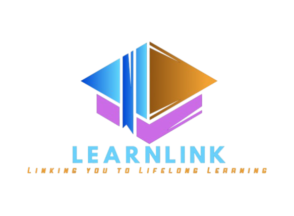

<p align="center">
    <picture>
    <source media="(prefers-color-scheme: dark)" srcset="./assets/Logo_noBg.png">
    <source media="(prefers-color-scheme: light)" srcset="./assets/Logo_noBg.png">
    
    </picture>
</p>

<p align="center">    
    <a href="">
        
    </a>   
    <a href="">
        
    </a>    
     <a href="">
        
    </a>   
    <a href="">
        
    </a>
    <a href="">
        
    </a>
    <a href="">
        
    </a>
    <a href="">
        
    </a>
</p>

<h4 align="center">
    <p>
        <a href="https://learn-link-mern.vercel.app/">Deployed URL</a>
    <p>
</h4>

LearnLink is an innovative e-learning platform designed to connect students with qualified tutors for personalized learning experiences. With a range of features aimed at enhancing the teaching and learning process, LearnLink provides a seamless and efficient platform for both students and tutors. Below are the key features implemented in the project:

## Features

- **Secure Authentication:** Utilizes JWT for token-based authentication and account management, ensuring secure access for users.
- **Real-time Personal Chat:** Connect with users in real-time using Socket.io.
- **Purchase Course and Certificate Download:** Integrated with Razorpay for secure payment transactions.
- **Admin Side Management:** Admin dashboard for managing and verifying users using Node.js and Express.js.

## UI Demo

<p align="center">
    <table>
        <tr>
            <td>
                
            </td>
            <td>
                
            </td>
        </tr>
        <tr>
            <td>
                
            </td>
            <td>
                
            </td>
        </tr>
    </table>
</p>


## Tech stack
Main web-frameworks and libraries:
- **React js:** JavaScript library for building user interfaces, facilitating the creation of interactive and dynamic web applications.
- **Redux (& Redux toolkit):** Predictable state container for JavaScript apps, enabling the management of application state in a centralized and consistent manner.
- **Tailwindcss:** Utility-first CSS framework for building custom designs quickly and efficiently, providing a set of pre-defined utility classes for styling HTML elements.
- **Node.js:** Server-side JavaScript execution environment to produce dynamic web pages and service requests.
- **Express.js:** The de facto standard web application framework for Node.js to build web applications including this one.
- **MongoDB(& mongoose.js):** NoSQL database, which serves as the database for this tech stack, for storing and retrieving data(CRUD opreations).
- **Payment integration:** Razorpay 
- Sweet Alert, react-toastify
- JWT tocken based Authentication
- BCrypt Hashing

LearnLink is successfully hosted on Frontend on Vercel and backend on AWS, and you can access the live site [https://learn-link-mern.vercel.app/](YOUR_DEPLOYED_URL)

## How to Host the Project Locally on Your System

1. **Clone the repository:**
   ```bash
   git clone YOUR_REPOSITORY_URL
